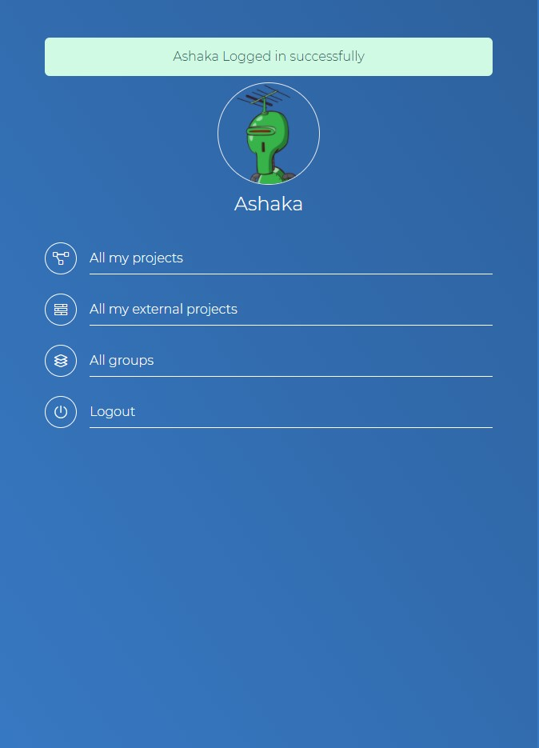
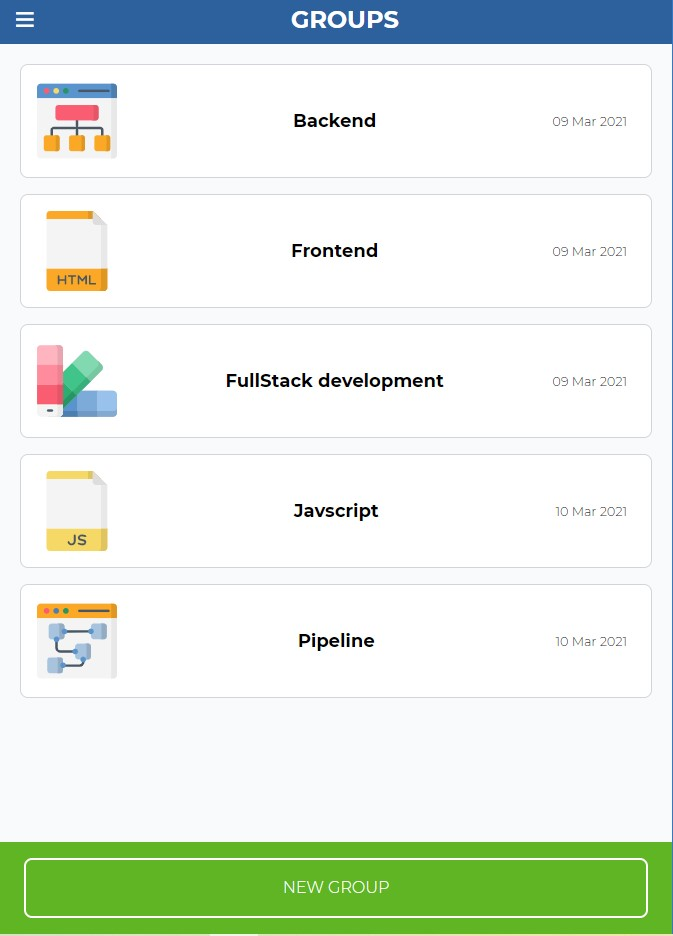

# Group Our Projects

> This is a Microvers Ruby on Rails capstone project, it is an app for grouping projects with a time constraint(Hours), it can be used to organize team projects.

## Features

- The user logs into the app by typing their name in the input field
- The user is presented with a profile page that includes links to:
  - All my projects
  - All my external projects
  - All groups
- A logged-in user can only see the list of projects he created.
- A logged-in user can see all the groups and he can associate a project to a group
- A logged-in user can create a group.

  
  
  
  
  

## Built With

- Ruby v2.7.2
- Ruby on Rails v5.2.4

## Live Demo

[Live Demo](https://www.loom.com/share/fada7e2ba52e43afa0705075c9a247bd)

## Getting Started

To get a local copy up and running follow these simple example steps.

### Prerequisites

Ruby: 2.7.2
Rails: 6.1.3
Postgres: >=12.5

### Setup

- Clone the repository in the folder of your choice:  

- Install required gems : 
`bundle install`

- Setup the database : 
`rails db:create` 
`rails db:migrate`

### Usage

- Start the server with:
`rails server` or `rails s`

- Open `http://localhost:3000/` in your browser.

### Run tests

- To run tests with RSpec :
`RSpec --format documentation`

### Deployment

Application deployed to Heroku

👤 **Ashaka Egerega**

- GitHub: [@AshakaE](https://github.com/AshakaE)
- LinkedIn: [AshakaE](https://www.linkedin.com/in/AshakaE/)

## 🤝 Contributing

Contributions, issues, and feature requests are welcome!

Feel free to check the [issues page](https://github.com/AshakaE/group-our-projects/issues).

## Show your support

Give a star if you like this project!

## Acknowledgments
Design concept by [Gregoire Vella](https://www.behance.net/gallery/19759151/Snapscan-iOs-design-and-branding?tracking_source=)

Reference for [N + 1](https://www.youtube.com/watch?v=oJ4Ur5XPAF8&ab_channel=BrianMorearty) problem.

Hat tip to [@David](https://github.com/Davidosky007) for code citing.

## 📝 License

Copyright 2021 Ashaka Egerega

Permission is hereby granted, free of charge, to any person obtaining a copy of this software and associated documentation files (the "Software"), to deal in the Software without restriction, including without limitation the rights to use, copy, modify, merge, publish, distribute, sublicense, and/or sell copies of the Software, and to permit persons to whom the Software is furnished to do so, subject to the following conditions:

The above copyright notice and this permission notice shall be included in all copies or substantial portions of the Software.

THE SOFTWARE IS PROVIDED "AS IS", WITHOUT WARRANTY OF ANY KIND, EXPRESS OR IMPLIED, INCLUDING BUT NOT LIMITED TO THE WARRANTIES OF MERCHANTABILITY, FITNESS FOR A PARTICULAR PURPOSE, AND NONINFRINGEMENT. IN NO EVENT SHALL THE AUTHORS OR COPYRIGHT HOLDERS BE LIABLE FOR ANY CLAIM, DAMAGES, OR OTHER LIABILITY, WHETHER IN AN ACTION OF CONTRACT, TORT OR OTHERWISE, ARISING FROM, OUT OF, OR IN CONNECTION WITH THE SOFTWARE OR THE USE OR OTHER DEALINGS IN THE SOFTWARE.
